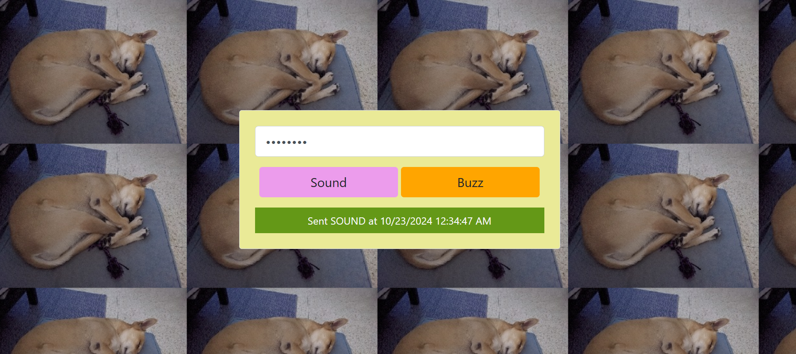
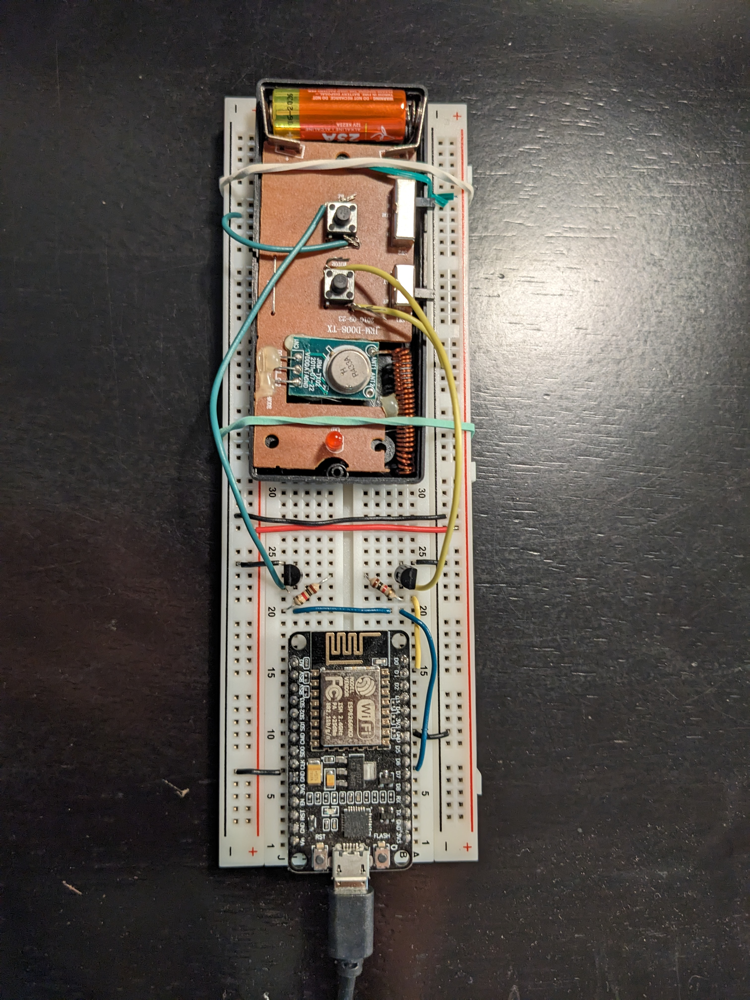
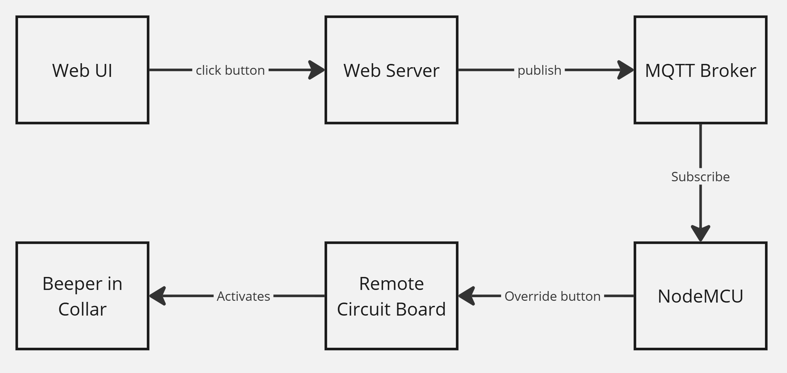
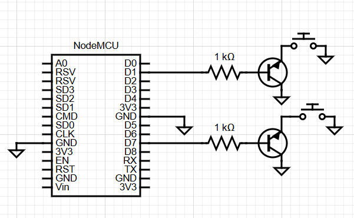

# Dog Node

## Project Description
This is a project that allows you to activate a button-controlled physical circuit over the internet. This project specifically applies this to a remote control that controls actions on a dog training collar, but it could be generalized to any sort of button-based circuit that you want to override. The remote has two buttons: one that causes the collar to emit a beeping noise (sound), and another than causes the collar to vibrate (buzz). 

The motivation is that this remote collar is a useful tool for dog training. We can train our dog so that the sound means "go to your bed" and the buzz means "stop barking". However, we also want to be able to use this when we are out of the house. We spy on our dog using a home camera, and if she is barking or pacing at the door, we want to be able to activate these controls so she knows to calm down. This is important since if left unchecked, the frantic behaviour can lead to excessive howling and biting at the door. Note that this isn't a shock/e-collar. Those have more specific training methods, and the risk of something going wrong with the circuit is too high. 

The main components include a website from which we can activate the sound and the buzz functionality, and a circuit, which is hooked up to the remote. The remote, in turn, activates the sound/buzz on the collar.

## How it Works

This remote activates simple beeping and vibrating mechanisms, and we want to be able to activate these buttons when we are away from a simple password-protected website. At a high-level, this is accomplished as follows:
- I've removed the cover of the remote so that I can get access to the circuit inside
- I add wires to either side of a button switch, which effectively bypasses the button. This would normally result in the button "always being pressed", however...
- I connect the button to a transistor, the base of which is connected to a NodeMCU output pin
- This allows me to control the "button press" using the NodeMCU. Once this circuit is set up, I have full control over the button press by programming the NodeMCU to send out high signals when I want the buttons activated. 

I want to be able to control the button over the internet, so I spun up a simple website with two button elements. When I click the button on the website, I want the NodeMCU to output a signal for 2 seconds, meaning the sound/buzz will occur for 2 seconds, and then shut off. I accomplish this by using an MQTT server. Both the web server and the NodeMCU can connect to the MQTT broker. When I click the button on the website, it publishes a message to the broker on a specific topic. The NodeMCU is also connected to the broker and is subscribed to that same topic. It will therefore receive the signal sent by the web server. Once that signal is received by the NodeMCU, we just need to program it to output a HIGH signal on the desired output pins, wait two seconds, and then turn the signal off. The website is hosted on the internet, so I can access this functionality from anywhere. For security purposes, the website user must enter the correct password, or the signal will not be sent to the MQTT server. 

The diagram below summarizes the basic functionality: 

## Building the project from scratch

### What you need

To build this project from scratch, the main components include some device with buttons that you want to override (for me it was the remote) and a NodeMCU. The other components required for the circuit include:
- Breadboard
- Jumper wires
- BC547 transistor (one for each button you are overriding)
- 1000 ohm resistor (one for each button you are overriding)

You will also need the following software and services
- Arduino IDE: For programming the NodeMCU
- MQTT server: I used HiveMQ
- Web hosting service: I used Microsoft Azure
- IDE and coding runtime: I programmed this in C#/.NET using VS code, but any language/framework that has an MQTT client library should work fine.  

### NodeMCU code

Begin by writing the code that will run on the NodeMCU. Use the .ino file as a template. The basic functionality is as follows:
- Define important variables, such as wifi creds, MQTT server creds, desired output pins
- Set up the functionality for the NodeMCU to connect to wifi
- Set up the functionality for the NodeMCU to connect to the MQTT broker
- The setup function on the node should attempt to connect to both wifi and the MQTT broker. You may want to include functionality in the looping function to check and ensure these connections are live.
- Configure a subscription to the topic on the MQTT broker
- Define a handling function when a message on this topic comes in (toggling pins, waiting, un-toggling pins)

### Wire up the circuit

Depending on the electronic equipment you are overriding, this will involve getting access to the circuit. Goes without saying when working with circuits and electricity, but BE CAREFUL. My remote was a very simple circuit with two buttons that were relatively easy to hook into. I just needed to wrap the jumper around the button terminals - no soldering required.

A basic circuit diagram is shown below. For my scenario, I was working with two buttons, so this is duplicated for my setup.

### A Note about Testing

Before putting all of the components (web server, circuit ino code) together, you may want to do some basic testing in isolation first. For example, you can swap out your target load with something simpler, like an LED, to make sure the circuit works as intended. Or you may want to program the NodeMCU to toggle the output every 10 seconds to ensure the code works appropriately, before connecting it to the MQTT server.

### MQTT Broker

You will need a running instance of an MQTT broker. You could potentially set up your own, but I used the cloud provider [HiveMQTT](https://www.hivemq.com), which comes with a free tier, which is all we need for this application. 

From your MQTT provider, you will get a host, a port, and a set of credentials. You may also need to initialize the desired topic and do some other basic configuration from the provider's web UI. Make sure the MQTT broker is running. You can now go back into your .ino file and fill in the MQTT config settings.

### Web App Front-end

Our web application will have a front-end and a back-end. The front-end will simply display a button element and optionally a password input as a simple security measure. When the user enters a password and presses the button, we will send the info to the back-end web server for validation and processing. 

I used basic .NET Razor pages for this project, but you could use any front-end framework. All that is needed is a single page with a simple form containing the password input and a button. In my scenario, I have two buttons, but it's the same principle. I've added some other basic front-end standards, such as a view model and some basic CSS styling. My front-end also uses bootstrap. When the user presses the button, they are submitting the form with a POST request to the back-end.

### Back-end

The back-end will receive the password and the button click from the front-end form. Since I have two circuit buttons to override (the sound and the buzz), I have two separate button elements, and pressing each one will send a different code to the back-end (i.e. the Buzz sends a "V" (for vibrate) and the sound sends an "S"). 

The first step is to validate the password. This is stored as a secret config. If the password input by the user does not match, then we return a failure message to be displayed to the user. If the password is correct, we move on to the main processing. The complete back-end code is not too complex, and you could probably put it all into a single file. I've split my functionality up to keep it a bit more organized, but this is not required.

The main processing simply involves connecting to our MQTT broker and publishing the message on the desired topic. It is the same broker and the same topic that our NodeMCU is connected to. The difference is that the web app is  *publishing* a message to the topic, and the NodeMCI is *subscribing* to the topic. The credentials for the MQTT broker should be stored somewhere secretly in your app settings and they should be used to connect once the password check has succeeded. Since I used C#/.NET, the HiveMQTT Client library is readily available and easy to use. Many other languages and frameworks appear to have their own libraries for connecting with an MQTT broker. 

Once the connection is made, we can publish a message on our target topic. If you are sending any specific content in the message that impacts how it is handled on the NodeMCU, ensure the contract is maintained. For example, in my project I use "S" to denote the "sound" command and "V" to denote the "buzz" command. Therefore I need to send those commands (depending on which button the user pressed on the front-end) over the MQTT broker, and they will be picked up and handled on the NodeMCU. 

You can also test this functionality in isolation, by ignoring the NodeMCU completely. Check the MQTT dashboard (if one is provided) as you test the web app functionality, and ensure that traffic is being sent to the MQTT broker. Once that is confirmed, you can hook the NodeMCU back up, and it should now receive those messages via its subscription.

